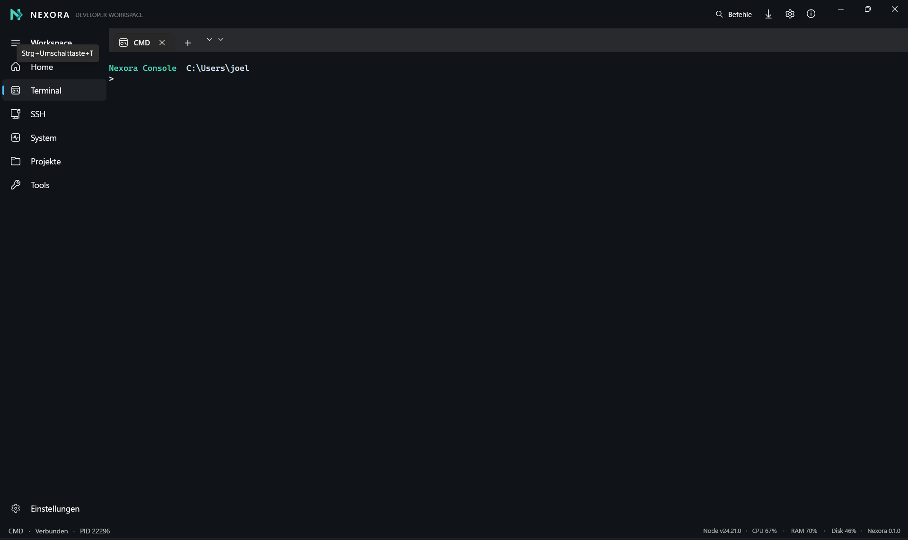
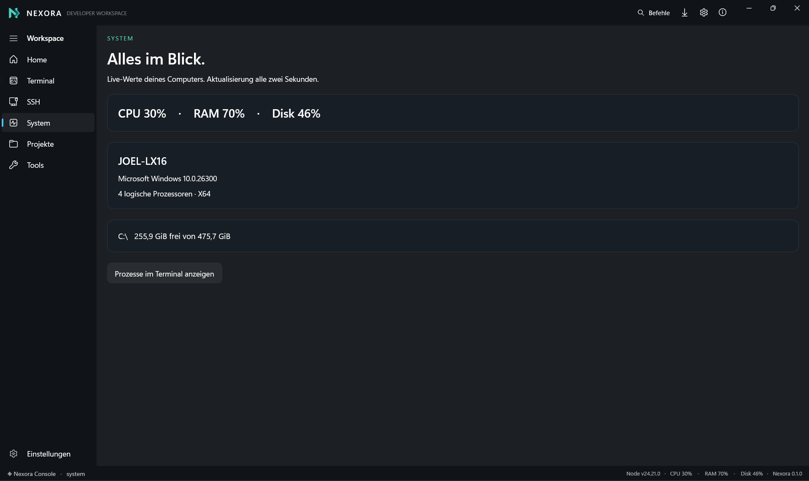

<div align="center">


# NEXORA

### DEVELOPER WORKSPACE

**Build. Connect. Control.**

Eine moderne Developer-Konsole für Windows, die Terminal, SSH,
Systemüberwachung, Projekte und Tools in einem Workspace vereint.

<br>


<br>

**Terminal · SSH · System · Projekte · Tools**

</div>

---

> [!IMPORTANT]
> **Nexora befindet sich aktuell in der Beta.**
>
> Die Anwendung ist bereits funktionsfähig und kann verwendet werden.
> Da es sich um eine Beta-Version handelt, können jedoch noch Fehler auftreten.
> Funktionen und Teile der Benutzeroberfläche können sich bis zur stabilen
> Veröffentlichung noch verändern.

---

## ◈ Was ist Nexora?

**Nexora** ist ein moderner **Developer Workspace für Windows**.

Die Anwendung wurde entwickelt, um häufig verwendete Entwicklungs-,
Terminal-, Remote- und Systemwerkzeuge in einer einzigen Oberfläche
zusammenzubringen.

Statt ständig zwischen verschiedenen Anwendungen zu wechseln, kannst du
mit Nexora deine Terminals öffnen, dich mit Servern verbinden,
Systeminformationen überwachen und deine Projekte verwalten.

Nexora ersetzt bestehende Werkzeuge wie **PowerShell, CMD oder OpenSSH**
nicht unnötig.

Stattdessen integriert Nexora diese Technologien in einen modernen
Workspace und erweitert sie um zusätzliche Funktionen.

> ### Ein Workspace. Deine Terminals. Deine Server. Deine Projekte.

---

# ✦ Features

<table>
<tr>

<td width="33%" valign="top">

### `>_` Terminal

Arbeite direkt innerhalb von Nexora mit deinen Windows-Shells.

- CMD
- PowerShell
- mehrere Terminal-Tabs
- parallele Sessions
- Command History
- Prozessinformationen

</td>

<td width="33%" valign="top">

### `◇` SSH

Verbinde dich direkt mit deinen Remote-Servern.

- Windows OpenSSH
- Serverprofile
- eigene Ports
- unterschiedliche Benutzer
- direkte Terminal-Verbindung
- gespeicherte Verbindungen

</td>

<td width="33%" valign="top">

### `▣` System

Behalte deinen Computer im Blick.

- CPU-Auslastung
- RAM-Auslastung
- Speicher
- Windows-Version
- Prozessorinformationen
- Live-Aktualisierung

</td>

</tr>

<tr>

<td width="33%" valign="top">

### `◆` Projekte

Verwalte deine Entwicklungsprojekte direkt innerhalb deines
Nexora Workspace.

</td>

<td width="33%" valign="top">

### `⌘` Tools

Nutze wichtige Developer- und Systemwerkzeuge über eine zentrale
Oberfläche.

</td>

<td width="33%" valign="top">

### `⚙` Einstellungen

Passe Nexora und deinen persönlichen Workspace an deine Anforderungen an.

</td>

</tr>
</table>

---

# `>_` Terminal

## Deine Konsole. Neu gedacht.

Das Nexora Terminal bildet einen zentralen Bestandteil des Developer Workspace.

CMD, PowerShell und unterstützte Shells können direkt innerhalb von Nexora
ausgeführt werden.

<div align="center">

<br>



<br>

**Nexora Terminal — Beta 0.1.0**

</div>

<br>

Das Terminal unterstützt mehrere Sitzungen und Tabs.

Dadurch kannst du beispielsweise gleichzeitig mit verschiedenen
Shells oder Arbeitsverzeichnissen arbeiten.

### Terminal-Funktionen

- CMD
- PowerShell
- mehrere Terminal-Tabs
- parallele Terminal-Sitzungen
- Command History
- Copy & Paste
- aktuelles Arbeitsverzeichnis
- Prozessinformationen
- Verbindungsstatus
- Terminal-Statusleiste

Die untere Statusleiste liefert zusätzliche Informationen über
die aktuelle Sitzung.

Beispiel:

```text
CMD  ·  Verbunden  ·  PID 22296
```

Auf der rechten Seite werden gleichzeitig wichtige Systeminformationen
angezeigt:

```text
Node v24.21.0  ·  CPU 67%  ·  RAM 70%  ·  Disk 46%  ·  Nexora 0.1.0
```

Dadurch bleiben wichtige Informationen sichtbar, ohne den eigentlichen
Terminalbereich zu überladen.

---

# ◇ SSH & Remote

## Deine Server. Direkt verbunden.

Nexora besitzt einen integrierten **SSH- und Remote-Bereich**.

Damit kannst du Verbindungen zu Linux-Servern oder anderen Systemen
mit SSH-Unterstützung direkt innerhalb von Nexora aufbauen.

Ein Serverprofil besteht beispielsweise aus:

```text
Name        Development
Server      server.example.com
Benutzer    deploy
Port        22
```

Anschließend kann die Verbindung direkt über Nexora gestartet werden.

Nexora verwendet dafür den **Windows OpenSSH Client**.

Eine entsprechende SSH-Verbindung könnte beispielsweise so aussehen:

```powershell
ssh deploy@server.example.com -p 22
```

Passwort-, SSH-Key- und Host-Abfragen werden weiterhin innerhalb
der Terminal-Sitzung verarbeitet.

---

## ◇ Serverprofile

Häufig verwendete Server können als Profile gespeichert werden.

Dadurch müssen Serveradresse, Benutzer und Port nicht bei jeder
Verbindung erneut eingegeben werden.

Beispiel:

```text
╭────────────────────────────────────────────╮
│                                            │
│  ◇ Development                            │
│                                            │
│  deploy@server.example.com                 │
│  Port 22                                   │
│                                            │
│  ● Bereit                                  │
│                                            │
│                     [ Verbinden → ]        │
│                                            │
╰────────────────────────────────────────────╯
```

Das macht Nexora besonders praktisch, wenn regelmäßig mit mehreren
Entwicklungs- oder Linux-Servern gearbeitet wird.

---

# ▣ System

## Alles im Blick.

Der integrierte Systembereich zeigt wichtige Informationen über
deinen Windows-PC direkt innerhalb von Nexora.

<div align="center">

<br>



<br>

**Nexora System Monitor — Live-Systeminformationen**

</div>

<br>

Die Systeminformationen werden automatisch aktualisiert.

Nexora zeigt unter anderem:

| Information | Beschreibung |
|:---|:---|
| **CPU** | Aktuelle Prozessorauslastung |
| **RAM** | Aktuelle Arbeitsspeicherauslastung |
| **Disk** | Aktuelle Speicherbelegung |
| **Computer** | Name des aktuellen Systems |
| **Windows** | Installierte Windows-Version |
| **Architektur** | Beispielsweise x64 |
| **Prozessoren** | Anzahl logischer Prozessoren |
| **Storage** | Freier und gesamter Speicherplatz |

Beispiel:

```text
SYSTEM

CPU      30%
RAM      70%
Disk     46%

JOEL-LX16

Microsoft Windows
4 logische Prozessoren · X64

C:\
255,9 GiB frei von 475,7 GiB
```

Die Live-Werte werden regelmäßig aktualisiert.

---

## Prozesse

Über die Funktion:

```text
Prozesse im Terminal anzeigen
```

können Prozessinformationen direkt an das Nexora Terminal
übergeben werden.

Dadurch bleiben Systemverwaltung und Terminal eng miteinander verbunden.

---

# ◆ Projekte

Nexora besitzt einen eigenen **Projekte-Bereich**.

Dieser Bereich ermöglicht es, Entwicklungsprojekte zentral innerhalb
des Nexora Workspace zu verwalten.

Projekte können so mit Terminal, Developer Tools und weiteren
Nexora-Funktionen kombiniert werden.

Nexora eignet sich unter anderem für Workflows mit:

```text
Node.js
.NET
C#
Java
Python
Git
```

Das Ziel ist, Projektverwaltung und Terminal möglichst nahtlos
miteinander zu verbinden.

---

# ⌘ Befehle

Über den Bereich **Befehle** können häufig verwendete Nexora-Aktionen
schnell aufgerufen werden.

Dadurch muss nicht jede Funktion über die Seitenleiste geöffnet werden.

Beispiele:

```text
Neues Terminal öffnen
CMD starten
PowerShell starten
SSH-Verbindung öffnen
Projekt öffnen
Systeminformationen anzeigen
Einstellungen öffnen
```

---

# 🧭 Navigation

Die Hauptnavigation von Nexora ist bewusst übersichtlich gehalten.

```text
⌂  Home

>_ Terminal

◇  SSH

▣  System

□  Projekte

⌘  Tools


⚙  Einstellungen
```

Dadurch sind die wichtigsten Bereiche jederzeit schnell erreichbar.

---

# ✦ Live Status

Nexora zeigt wichtige Informationen dauerhaft in der unteren
Statusleiste an.

Beispielsweise:

```text
Node v24.21.0
CPU 30%
RAM 70%
Disk 46%
Nexora 0.1.0
```

Die Werte aktualisieren sich automatisch.

So bleiben wichtige Systeminformationen sichtbar, ohne dafür
den Systembereich öffnen zu müssen.

---

# 🎨 Design

Nexora besitzt eine eigene, bewusst reduzierte Designsprache.

Die Benutzeroberfläche kombiniert einen dunklen Developer Workspace
mit der charakteristischen Nexora-Akzentfarbe.

### Designprinzipien

- dunkles Interface
- Türkis als Nexora-Akzentfarbe
- minimalistische Icons
- klare Navigation
- dezente Rahmen
- große Arbeitsbereiche
- reduzierte Animationen
- übersichtliche Statusinformationen
- konsistente Typografie

Das Ziel ist eine moderne Oberfläche, die auch bei längeren
Entwicklungs- und Administrationsarbeiten angenehm zu verwenden ist.

---

# ◈ Nexora Branding

Das Nexora-Logo verbindet das **N** von Nexora mit einem nach rechts
gerichteten Element.

<div align="center">

<br>


<br>

### NEXORA

**DEVELOPER WORKSPACE**

**Build. Connect. Control.**

</div>

---

# 🔐 Sicherheit

Besonders bei SSH- und Remote-Verbindungen spielt Sicherheit eine
wichtige Rolle.

Nexora setzt deshalb auf etablierte Windows- und SSH-Technologien.

Zu den Sicherheitsprinzipien gehören:

- keine fest eingebauten Passwörter
- keine Zugangsdaten im Quellcode
- Verwendung von Windows OpenSSH
- SSH Host Verification
- keine automatische Umgehung von SSH-Sicherheitswarnungen
- sichere Behandlung sensibler Verbindungsinformationen
- Unterstützung bestehender SSH-Sicherheitsmechanismen

---

# ⚙ Technologie

Nexora wurde speziell für Windows entwickelt.

| Bereich | Technologie |
|:---|:---|
| **Produkt** | Nexora |
| **Typ** | Developer Workspace |
| **Plattform** | Windows |
| **Sprache** | C# |
| **Framework** | .NET |
| **Remote** | Windows OpenSSH |
| **Aktuelle Version** | 0.1.0 |
| **Release Channel** | Beta |

---

# 🧪 Beta

> [!WARNING]
> ## Nexora befindet sich aktuell in der Beta.
>
> Die Anwendung ist bereits funktionsfähig und kann verwendet werden.
>
> Da Nexora noch nicht als stabile Version veröffentlicht wurde,
> können Fehler auftreten.
>
> Funktionen, Benutzeroberfläche und interne Komponenten können während
> der Beta weiter verbessert oder verändert werden.

Die Beta dient insbesondere dazu, Fehler zu finden und Nexora vor
einer stabilen Veröffentlichung weiter zu optimieren.

---

# 🐛 Bug Reports

Du hast einen Fehler in Nexora gefunden?

Dann kannst du ein **GitHub Issue** erstellen.

Bitte gib nach Möglichkeit folgende Informationen an:

```text
Nexora Version:
Windows Version:

Was ist passiert?

Was sollte passieren?

Schritte zum Reproduzieren:

1.
2.
3.

Fehlermeldung:

Screenshot:
```

Je genauer ein Fehler beschrieben wird, desto einfacher kann er
nachvollzogen werden.

---

# 💡 Feature Requests

Ideen und Verbesserungsvorschläge für Nexora sind ebenfalls willkommen.

Ein Feature Request sollte möglichst erklären:

```text
Was soll hinzugefügt werden?

Welches Problem löst die Funktion?

Wie könnte die Funktion funktionieren?
```

---

# 🗺 Roadmap

Nexora ist bereits funktionsfähig.

Die weitere Entwicklung konzentriert sich auf neue Funktionen,
Verbesserungen und die Vorbereitung auf eine stabile Version.

### ◈ Beta

- [x] Nexora Workspace
- [x] Terminal
- [x] CMD
- [x] PowerShell
- [x] Terminal Tabs
- [x] SSH / Remote
- [x] Serverprofile
- [x] System Monitor
- [x] Live-Systemwerte
- [x] Projekte-Bereich
- [x] Tools-Bereich
- [x] Einstellungen

### ◈ Nächste Updates

- [ ] weitere Terminal-Funktionen
- [ ] erweiterte SSH-Verwaltung
- [ ] zusätzliche Developer Tools
- [ ] Verbesserungen am Projekte-Bereich
- [ ] weitere Nexora-Befehle
- [ ] Performance-Optimierungen
- [ ] UI- und UX-Verbesserungen

### ◈ Zukunft

- [ ] Plugin-System
- [ ] zusätzliche Themes
- [ ] erweiterte Git-Integration
- [ ] zusätzliche Remote-Werkzeuge
- [ ] weitere Automatisierungsfunktionen
- [ ] zusätzliche Anpassungsmöglichkeiten

---

# 📸 Screenshots

## `>_` Terminal

<div align="center">


</div>

<br>

## ▣ System Monitor

<div align="center">


</div>

---

# 📁 Repository-Struktur

Die Assets für die README befinden sich aktuell unter:

```text
nexora-console/
│
├── README.md
│
└── Nexora/
    └── assets/
        ├── nexora-logo.png
        │
        └── screenshots/
            ├── terminal.png
            └── system.png
```

Da sich die `README.md` im Hauptverzeichnis des Repositorys befindet,
beginnen die Bildpfade mit:

```text
Nexora/assets/
```

Die verwendeten Pfade sind:

```text
Nexora/assets/nexora-logo.png
Nexora/assets/screenshots/terminal.png
Nexora/assets/screenshots/system.png
```

---

# 📦 Releases

Nexora wird aktuell über den **Beta Release Channel** veröffentlicht.

Aktuelle Version:

```text
Nexora 0.1.0 Beta
```

Zukünftige Versionen können beispielsweise folgen als:

```text
Nexora 0.2.0 Beta
Nexora 0.3.0 Beta

Nexora 1.0.0
```

---

# 🤝 Feedback

Feedback hilft dabei, Nexora weiterzuentwickeln.

Über GitHub können insbesondere folgende Dinge gemeldet werden:

- Bugs
- Verbesserungsvorschläge
- Feature Requests
- UI/UX-Probleme
- Terminal-Probleme
- SSH-Probleme
- Performance-Probleme

---

<div align="center">

<br>
<br>


# NEXORA

### DEVELOPER WORKSPACE

**Build. Connect. Control.**

<br>

`Terminal` · `SSH` · `System` · `Projects` · `Tools`

<br>

**Built for Windows.**

<br>

### Nexora 0.1.0 Beta

</div>
